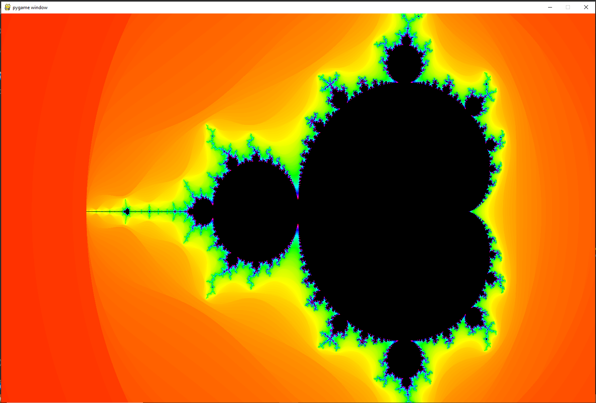

# Mandelbrot Set

Classic Mandlebrot set using Python 3.8.

## Controls are

* u : rotate anti-clockwise
* c : rotate clockwise
* \+ : zoom in
* \- : zoom out
* up arrow: scroll up
* down arrow: scroll down
* left arrow: scroll left
* right arrow: scroll right
* h : high quality (takes about 10-15 seconds)

## Credits

M. Betteridge for the initial implementation.